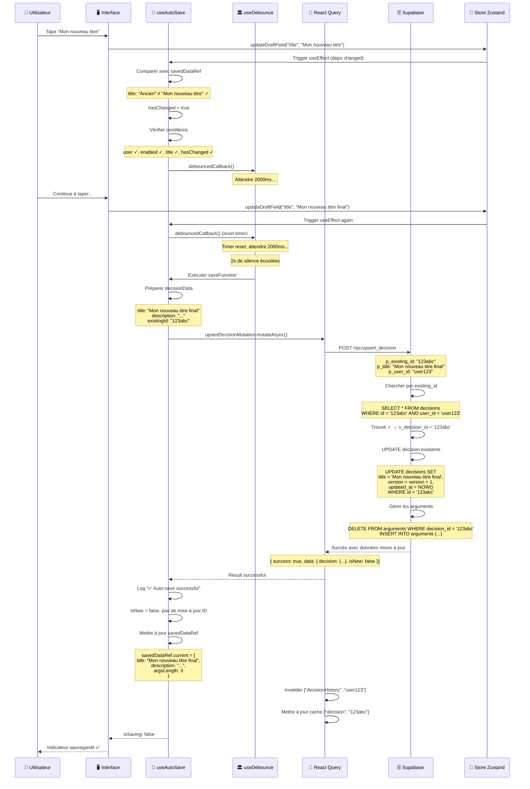
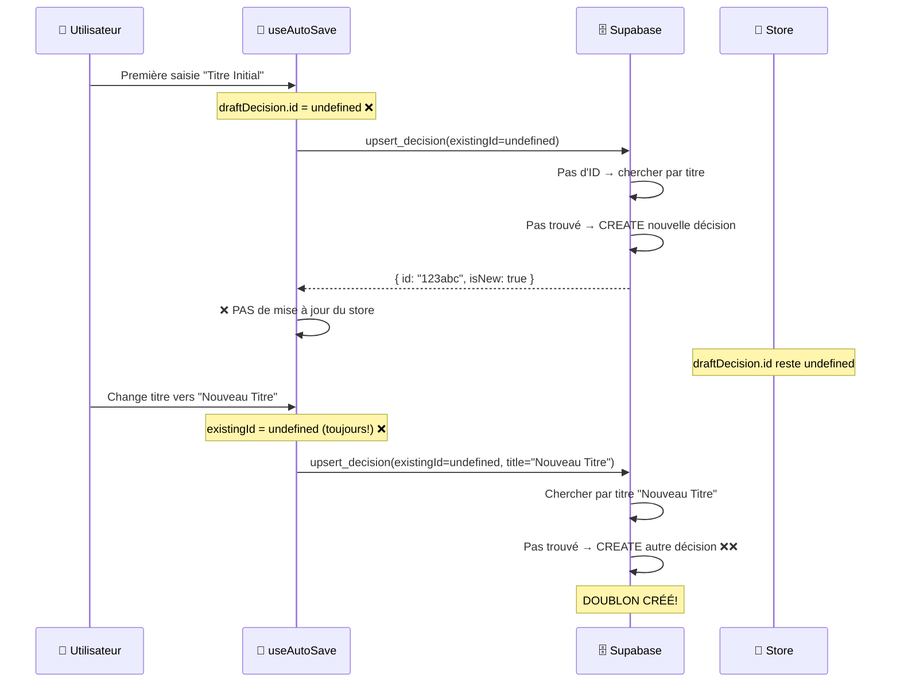
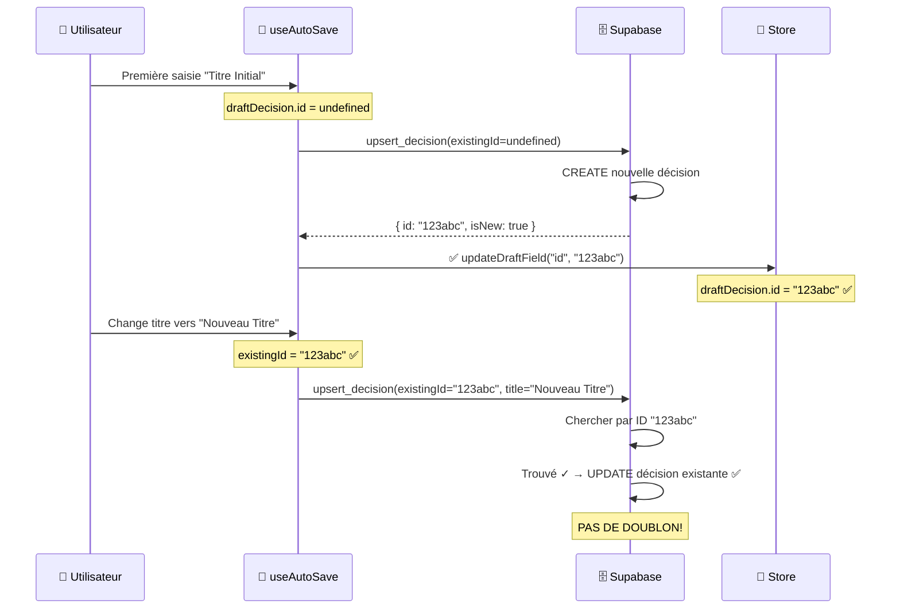
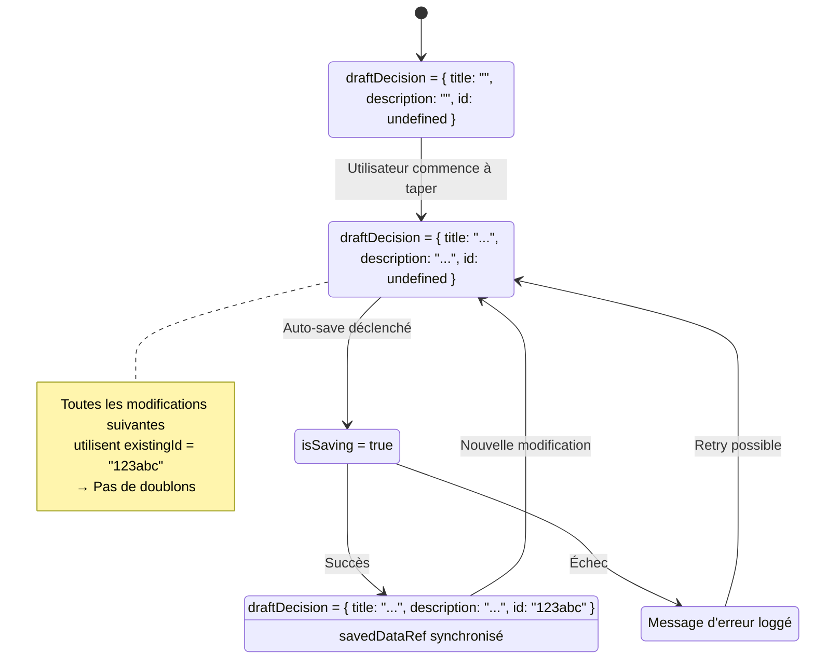
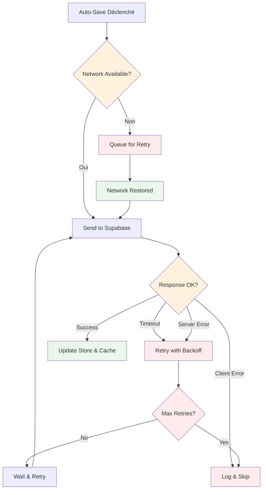

# Diagrammes de Séquence - Système Auto-Save

## Séquence Complète : Modification de Titre avec Sauvegarde

## Séquence Problématique Résolue : Première Sauvegarde

### AVANT (Problématique - Doublons)

### APRÈS (Corrigé - Pas de Doublons)

## États du Système

### Store Zustand - État de la Décision

## Timing Critique - Debouncing

```mermaid
gantt
    title Exemple de Timing Auto-Save avec Debouncing
    dateFormat X
    axisFormat %Ls
    
    section Utilisateur Tape
    T                    :milestone, t1, 0, 0ms
    i                    :milestone, t2, 200, 0ms
    t                    :milestone, t3, 400, 0ms
    r                    :milestone, t4, 600, 0ms
    e                    :milestone, t5, 800, 0ms
    (espace)             :milestone, t6, 1000, 0ms
    M                    :milestone, t7, 1200, 0ms
    o                    :milestone, t8, 1400, 0ms
    n                    :milestone, t9, 1600, 0ms
    
    section Debounce Timers
    Timer 1 (T)          :timer1, 0, 2000
    Timer 2 (i)          :timer2, 200, 2000
    Timer 3 (t)          :timer3, 400, 2000
    Timer 4 (r)          :timer4, 600, 2000
    Timer 5 (e)          :timer5, 800, 2000
    Timer 6 (space)      :timer6, 1000, 2000
    Timer 7 (M)          :timer7, 1200, 2000
    Timer 8 (o)          :timer8, 1400, 2000
    Timer Final (n)      :done, timer9, 1600, 2000
    
    section Sauvegarde
    Execution            :crit, save, 3600, 200
```

## Points de Défaillance et Récupération

---

**Note** : Ces diagrammes montrent les interactions critiques du système. En cas de problème, référez-vous à ces séquences pour identifier où le flux peut être interrompu.
