# Architecture du Système d'Auto-Save Robuste

## Vue d'Ensemble

Ce système d'auto-save a été conçu pour prévenir les doublons et assurer une sauvegarde fiable des décisions en cours d'édition. Il utilise un mécanisme de debouncing, de détection de changements intelligente et d'UPSERT atomique.

## Schéma de Fonctionnement

```mermaid
flowchart TD
    %% Déclencheurs
    A[Utilisateur modifie] --> B{Type de modification}
    B -->|Titre| C[Title Change]
    B -->|Description| D[Description Change] 
    B -->|Arguments| E[Arguments Change]
    
    C --> F[useAutoSave useEffect]
    D --> F
    E --> F
    
    %% Logique de détection de changements
    F --> G{Vérification conditions}
    G -->|user exists?| H{enabled?}
    H -->|title exists?| I{Données changées?}
    
    I -->|Oui| J[Déclencher debounced callback]
    I -->|Non| K[Skip - pas de changements]
    
    %% Système de debouncing
    J --> L[useDebounce 2000ms]
    L --> M{Timeout écoulé?}
    M -->|Non| N[Attendre...]
    N --> M
    M -->|Oui| O[Exécuter saveFunction]
    
    %% Fonction de sauvegarde
    O --> P{Validation finale}
    P -->|user && enabled && title| Q[Préparer données]
    P -->|Sinon| R[Abandonner sauvegarde]
    
    Q --> S[upsertDecisionMutation]
    
    %% Logique UPSERT côté serveur
    S --> T[Fonction SQL upsert_decision]
    T --> U{existingId fourni?}
    U -->|Oui| V[Chercher par ID]
    U -->|Non| W[Chercher par titre]
    
    V --> X{Décision trouvée par ID?}
    X -->|Oui| Y[UPDATE décision existante]
    X -->|Non| W
    
    W --> Z{Décision trouvée par titre?}
    Z -->|Oui| Y
    Z -->|Non| AA[CREATE nouvelle décision]
    
    %% Mise à jour
    Y --> BB[Version + 1]
    BB --> CC[Supprimer anciens arguments]
    CC --> DD[Insérer nouveaux arguments]
    
    AA --> EE[Version = 1]
    EE --> DD
    
    DD --> FF[RETURNING données complètes]
    
    %% Gestion du résultat côté client
    FF --> GG{Sauvegarde réussie?}
    GG -->|Erreur| HH[Log erreur + abandonner]
    GG -->|Succès| II[Log succès]
    
    II --> JJ{Nouvelle décision?}
    JJ -->|Oui| KK[updateDraftField ID]
    JJ -->|Non| LL[Pas de mise à jour ID]
    
    KK --> MM[Mise à jour savedDataRef]
    LL --> MM
    
    MM --> NN[Fin du cycle]
    
    %% Styles
    classDef userAction fill:#e1f5fe
    classDef logic fill:#f3e5f5
    classDef database fill:#e8f5e8
    classDef success fill:#e8f5e8
    classDef error fill:#ffebee
    
    class A,C,D,E userAction
    class F,G,H,I,J,L,M,O,P,U,X,Z logic
    class T,V,W,Y,AA,BB,CC,DD,EE,FF database
    class II,KK,LL,MM,NN success
    class R,HH error
```



## Composants Clés

### 1. useAutoSave Hook
```typescript
// Localisation: hooks/use-auto-save.ts
// Responsabilités:
// - Détecter les changements de données
// - Gérer le debouncing (2 secondes)
// - Déclencher la sauvegarde
// - Mettre à jour l'ID après création
```

### 2. Détection de Changements Intelligente
```typescript
// Mécanisme avec useRef pour éviter les sauvegardes inutiles
const hasChanged = (
  currentData.title !== savedDataRef.current.title ||
  currentData.description !== savedDataRef.current.description ||
  currentData.argsLength !== savedDataRef.current.argsLength
)
```

### 3. Fonction SQL upsert_decision
```sql
-- Localisation: supabase/migrations/20250819100000_add_robustness_features.sql
-- Logique:
-- 1. Chercher par existing_id si fourni
-- 2. Sinon chercher par (user_id, title)
-- 3. UPDATE si trouvé, INSERT sinon
-- 4. Gestion atomique des arguments
```

## Points Critiques de Sécurité

### ✅ Prévention des Doublons
- **Contrainte unique** : `unique_user_title` en base
- **UPSERT atomique** : Une seule opération SQL
- **Recherche par ID prioritaire** : Évite les conflits de titre

### ✅ Gestion des Conflits
- **Verrouillage optimiste** : Colonne `version`
- **Vérification d'ownership** : `auth.uid() = user_id`
- **Gestion d'erreurs robuste** : Types d'erreurs spécifiques

### ✅ Performance
- **Debouncing** : Évite les appels excessifs
- **Détection de changements** : Seulement si nécessaire
- **Index SQL** : `idx_decisions_user_title`, `idx_decisions_user_updated`

## Flux de Données Critique

### Problème Résolu : Changement de Titre
**Avant** (problématique) :
```
1. Sauvegarde initiale : title="Titre 1" → crée ID=123
2. Store client : draftDecision.id = undefined ❌
3. Changement titre : title="Titre 2", existingId=undefined
4. Recherche par ancien titre → pas trouvé → création doublon ❌
```

**Après** (corrigé) :
```
1. Sauvegarde initiale : title="Titre 1" → crée ID=123
2. Auto-update store : updateDraftField("id", "123") ✅
3. Changement titre : title="Titre 2", existingId="123"
4. Recherche par ID → trouvé → mise à jour ✅
```

## Cas d'Usage Supportés

### ✅ Création de Nouvelle Décision
- Titre initial → `existingId=undefined` → CREATE
- Store mis à jour avec nouvel ID

### ✅ Modification de Décision Existante
- Titre/Description/Arguments → `existingId` fourni → UPDATE
- Versioning automatique

### ✅ Gestion d'Erreurs
- Contrainte unique violée → `DuplicateTitleError`
- Conflit de version → `OptimisticLockError`
- Authentification → `AuthenticationError`

## Monitoring et Debug

### Logs Disponibles
```typescript
// Logs de déclenchement
"🔄 Auto-save effect triggered"
"🚀 Triggering debounced callback"

// Logs de sauvegarde
"✅ Auto-save successful"
"❌ Auto-save failed"
"🔧 Updating draft decision ID"
```

### Métriques à Surveiller
- Fréquence de sauvegarde par session
- Ratio succès/échec
- Temps de réponse UPSERT
- Nombre de conflits détectés

## Dépendances Techniques

### Frontend
- `@tanstack/react-query` : Cache et mutations
- `zustand` : State management local
- `zod` : Validation des données

### Backend
- `supabase` : Base de données PostgreSQL
- `RLS` : Row Level Security
- `auth.uid()` : Authentification utilisateur

## Plan de Maintenance

### Tests à Implémenter
1. **Test de concurrence** : Modifications simultanées
2. **Test de réseau** : Sauvegarde hors ligne
3. **Test de performance** : Charge utilisateur élevée

### Evolution Possible
- **Sauvegarde hors ligne** : Queue avec retry
- **Résolution de conflits UI** : Interface utilisateur
- **Historique des versions** : Audit trail complet

---

**Créé le** : 19 août 2025  
**Version système** : 1.0.0 Robuste  
**Dernière mise à jour** : Correction du problème de duplication sur changement de titre
